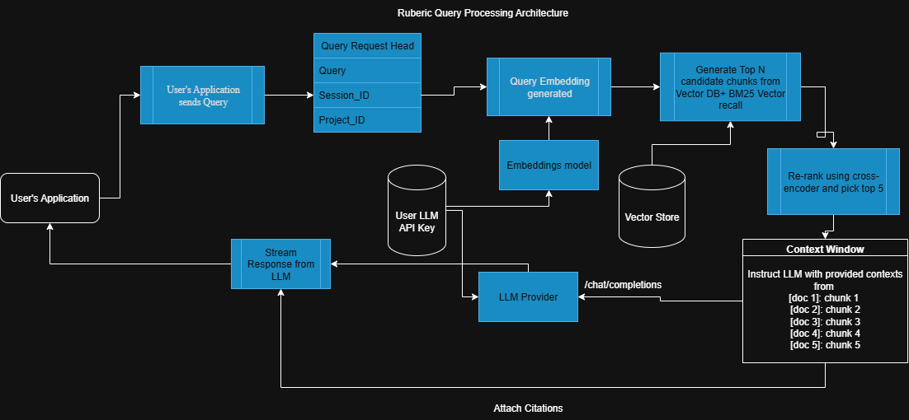

# Ruberic
Ruberic is an open-source **documentation chatbot assistant** powered by **RAG (Retrieval-Augmented Generation)**.  
It lets you connect your own LLM provider (**BYOK – Bring Your Own Key**) and build a powerful doc search assistant for your projects.  

## Getting Started

Ruberic is a BYOK software that can be accessed through API endpoints and an API key that you can access through the dashboard. Here's more precisely how the Ruberic bot works: 

### Query Processing
The following architecture provides a brief insight into how Ruberic processes queries sent from your applications. 

### Ingestion 
For now I'm trying to accept direct pdfs, doc files for documentations. But later on I plan to add crawlers that can retrieve significant documentation data that can be ingested into the vector DB. 